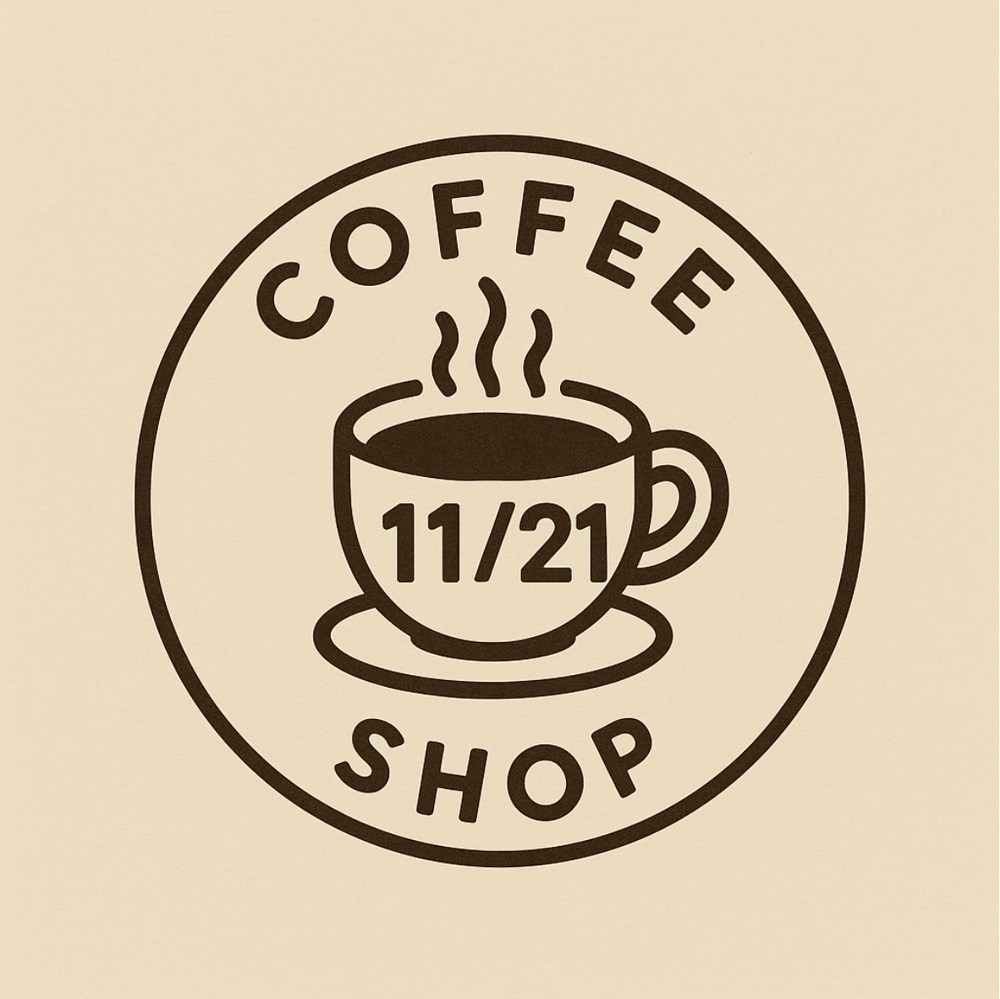
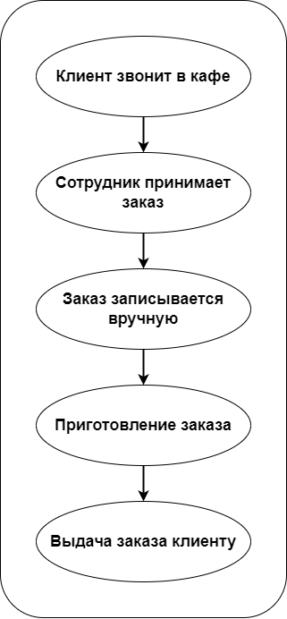
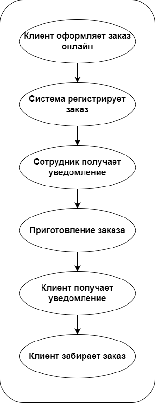
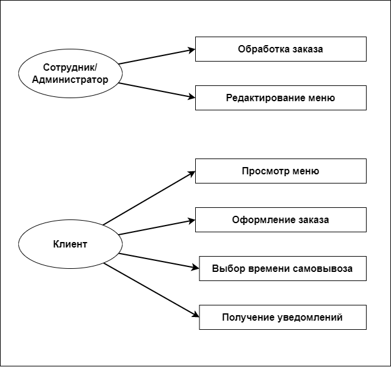
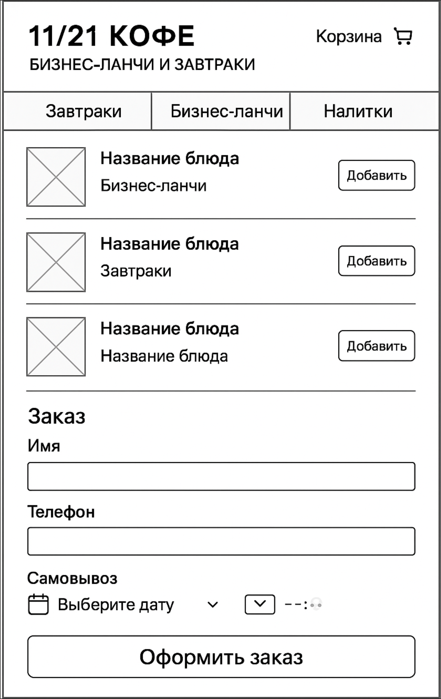

# ☕ Онлайн-система заказов для кафе «11/21 Кофе»

---

## 🎯 Цель проекта
Создать онлайн-канал заказов с функцией самовывоза, чтобы снизить нагрузку на персонал и повысить удобство для клиентов.

---

## 🔍 Контекст
- Формат заведения: кафе, специализация — завтраки и бизнес-ланчи  
- Проблема **AS-IS:** заказы принимаются по телефону или лично, что создаёт очереди и ошибки  
- Решение **TO-BE:** создание онлайн-меню с функцией оформления заказа и уведомления о готовности  

---

## 📊 Артефакты проекта
| Тип | Имя файла | Описание |
|------|------------|-----------|
| BPMN AS-IS | `bpmn_as_is.png` | текущий процесс до автоматизации |
| BPMN TO-BE | `bpmn_to_be.png` | целевой процесс после внедрения системы |
| Use Case | `use_case.png` | взаимодействие акторов и системы |
| Wireframe | `prototype.png` | макет пользовательского интерфейса онлайн-заказа |

---

## 📈 Диаграммы и визуализация

### 🧩 Диаграмма бизнес-процесса AS-IS  
Процесс работы кафе **до автоматизации**:

---

### 🚀 Диаграмма бизнес-процесса TO-BE  
Процесс работы **после внедрения онлайн-системы заказов**:

---

### 👥 Диаграмма вариантов использования (Use Case)  
Показывает роли (клиент, кассир, система) и сценарии взаимодействия:

---

### 🖥️ Прототип интерфейса  
Макет пользовательского интерфейса онлайн-заказа:

---

## 🧠 Роль аналитика
- Анализ текущего бизнес-процесса (AS-IS)  
- Моделирование целевого процесса (TO-BE)  
- Формализация функциональных и нефункциональных требований  
- Подготовка Use Case и глоссария  
- Создание wireframe интерфейса  

---

## 💡 Результаты и эффект
- Снижение нагрузки на персонал в часы пик  
- Уменьшение количества ошибок при приёме заказов  
- Повышение скорости обслуживания  
- Повышение лояльности клиентов через удобный интерфейс  

---

> 👩‍💻 Автор проекта: **Ксения Галышева**  
> 📍 Бишкек · готова к удалённой работе  
> ✉️ 79091057698kg@gmail.com  
> ☕ Проект реализован в рамках портфолио системного аналитика
